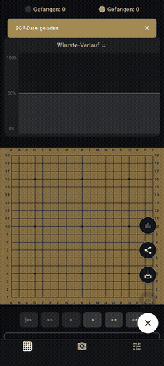
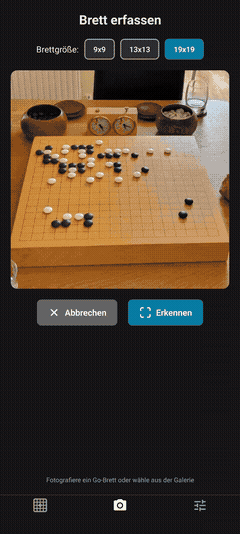
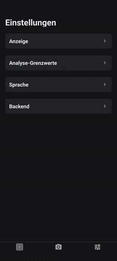
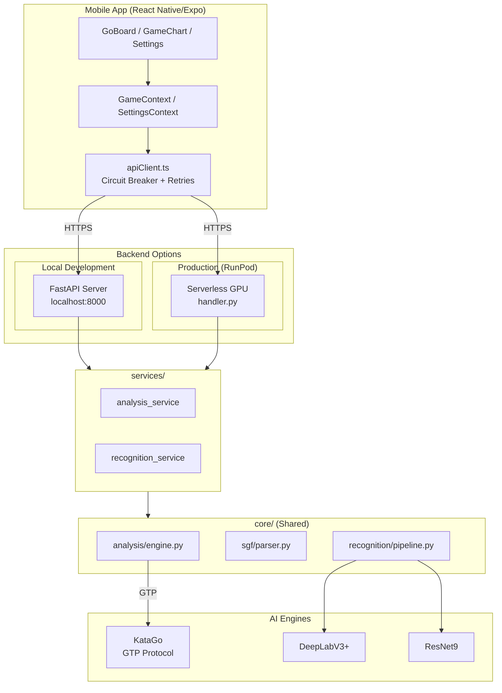

<p align="center">
  <h1 align="center">Go Analysis Project</h1>
  <p align="center">
    <b>AI-powered Go game analysis with computer vision board recognition</b>
  </p>

</p>


<p align="center">
  <a href="https://github.com/pnke/GoMobileAnalyzer/actions/workflows/cy.yml"></a>
  <a href="https://codecov.io/gh/pnke/GoMobileAnalyzer"></a>
</p>

---

## Demo

<table>
  <tr>
    <td align="center" width="33%">
      <br/><br/>
      <b>🎯 AI Analysis</b><br/>
      <sub>KataGo-powered move evaluation with<br/>win rate & score estimates</sub>
    </td>
    <td align="center" width="33%">
      <br/><br/>
      <b>📷 Board Detection</b><br/>
      <sub>Automatic recognition of Go boards<br/>from photos using deep learning</sub>
    </td>
    <td align="center" width="33%">
      <br/><br/>
      <b>⚙️ Settings</b><br/>
      <sub>Customizable analysis parameters<br/>and server configuration</sub>
    </td>
  </tr>
</table>

---

## About This Project


- **Mobile Development** — Cross-platform React Native app with Expo
- **Backend Engineering** — Async Python API with FastAPI and WebSocket support
- **Machine Learning** — Custom-trained neural networks for board segmentation and stone classification
- **Cloud Deployment** — Serverless GPU infrastructure on RunPod
- **DevOps** — CI/CD pipeline with GitHub Actions, code coverage, and automated testing

### Key Technical Highlights

| Area | Technologies & Patterns |
|------|------------------------|
| **Frontend** | React Native, Expo, TypeScript, Context API, Custom Hooks |
| **Backend** | FastAPI, async/await, WebSocket streaming, subprocess management |
| **ML Pipeline** | PyTorch, DeepLabV3+ (segmentation), ResNet9 (classification), custom training pipeline |
| **AI Integration** | KataGo engine integration via GTP protocol |
| **Testing** | Jest (frontend), pytest (backend), 75%+ coverage target |
| **Infrastructure** | Docker, NVIDIA CUDA, RunPod serverless GPU |

---

## Architecture



---

## Project Structure

```
GoRemoteAnalyse/
├── App/                    # React Native (Expo) Frontend
│   ├── features/           # Feature modules (analysis, game, board-recognition, settings)
│   ├── components/         # Shared UI components
│   └── __tests__/          # Frontend unit & integration tests
│
├── ServerGo/               # Python FastAPI Backend
│   ├── core/               # Business logic (analysis, recognition, SGF parsing)
│   ├── services/           # Service layer (analysis_service, recognition_service)
│   ├── serverless/         # Docker config for RunPod GPU deployment
│   └── tests/              # Backend pytest suite
│
└── docs/                   # Architecture Decision Records (ADRs)
```

---

## Getting Started

### Prerequisites
- Node.js (LTS) & npm
- Python 3.8+
- Expo Go app on your phone

### Quick Start

```bash
# Clone the repository
git clone https://github.com/YOUR-USERNAME/YOUR-REPO-NAME.git
cd YOUR-REPO-NAME

# Run the Mobile App
cd App && npm install
npx expo start
# → Scan QR code with Expo Go

# Run the Backend (separate terminal)
cd ServerGo
python -m venv venv && .\venv\Scripts\activate  # Windows
pip install -r requirements.txt
python main.py
# → Server at http://localhost:8000
```

---

##  Testing

```bash
# Frontend Tests (Jest)
cd App && npm test

# Backend Tests (pytest)
cd ServerGo && python run_tests.py
```

Both test suites are part of the CI pipeline and run automatically on every push.

---

## Docker Deployment

```bash
cd ServerGo/GoDocker
docker build -t go-analysis-engine .
docker run --gpus all -p 8000:8000 go-analysis-engine
```

Optimized for serverless GPU deployment on RunPod with NVIDIA CUDA 12.1 and KataGo v1.16.3.

---

## Documentation

Detailed architecture decisions are documented in the `docs/` folder:
- [ADR-001: Backend Architecture](docs/ADR-001-Backend-Architecture.md)
- [ADR-002: Frontend Architecture](docs/ADR-002-Frontend-Architecture.md)
- [ADR-003: ML Recognition Pipeline](docs/ADR-003-ML-Recognition.md)

---

## License

This project is licensed under the MIT License.
