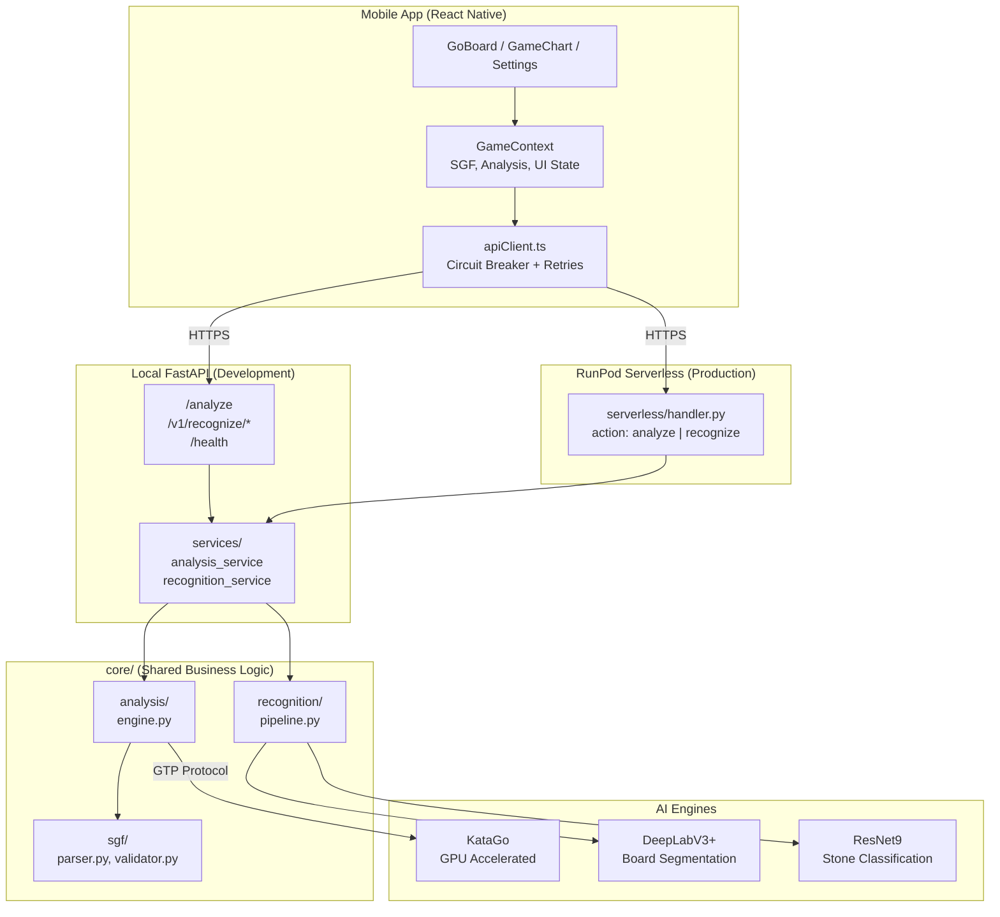
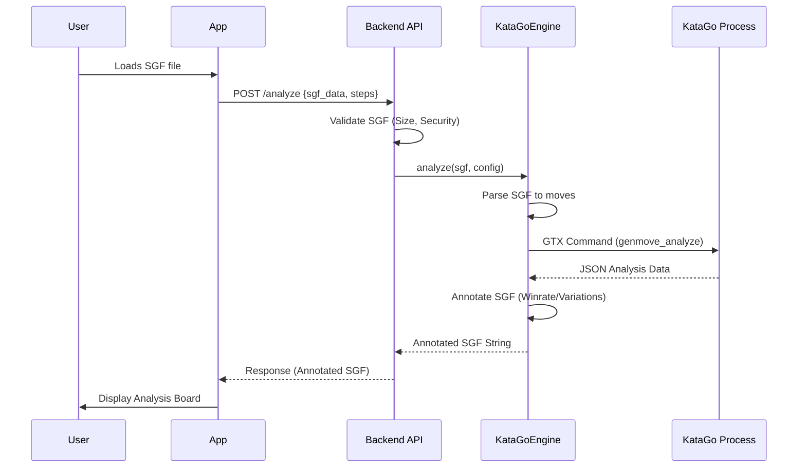

# ADR-001: Backend Architecture

## Context
The Go Analysis App requires a backend to run KataGo analysis on SGF files. We need to support both local development and cloud deployment with GPU acceleration.

## Decision
We use a **unified dual-mode architecture** with shared business logic:

1. **Local Development**: FastAPI server (`ServerGo/`) running KataGo directly
2. **Production**: RunPod serverless (`ServerGo/serverless/`) for GPU-accelerated analysis
3. **Shared Core**: Business logic in `core/` used by both modes

## System Architecture



## Component Responsibilities

### Layered Architecture

| Layer | Location | Responsibility |
|-------|----------|----------------|
| **Routers** | `routers/` | HTTP endpoints, request validation |
| **Services** | `services/` | Async orchestration, caching |
| **Core** | `core/` | Pure business logic (shared) |
| **Schemas** | `schemas/` | Pydantic models |

### Core Components

| Component | Location | Responsibility |
|-----------|----------|----------------|
| `sync_engine.py` | `core/analysis/` | KataGo GTP protocol, subprocess management |
| `async_engine.py` | `core/analysis/` | Async wrapper for streaming analysis |
| `parser.py` | `core/sgf/` | SGF parsing, move extraction |
| `validator.py` | `core/sgf/` | Security validation, size limits |
| `universal_go_recognizer.py` | `services/` | Board detection + stone classification pipeline |
| `handler.py` | `serverless/` | RunPod serverless entry point |

### Middleware Stack

```
Request → CorrelationId → RateLimit → BodySizeLimit → CORS → Router
```

| Middleware | Purpose |
|------------|---------|
| `CorrelationIdMiddleware` | Request tracing with `X-Correlation-ID` |
| `RateLimiterMiddleware` | 30 req/min per IP |
| `BodySizeLimitMiddleware` | Max 1MB request body |

## Data Flow

### Analysis Request Flow



### Error Handling

| Layer | Strategy |
|-------|----------|
| Frontend | Circuit breaker (3 failures → open 30s) |
| API Client | Exponential backoff retries (3 attempts) |
| Backend | Structured errors with request ID |
| KataGo | Timeout (120s), auto-restart on failure |

## Why This Approach

| Decision | Rationale |
|----------|-----------|
| Dual-mode | Local dev without cloud costs; production scales to zero, easy private deploy on home PC |
| Shared `core/` | DRY principle, single source of truth for KataGo interaction |
| FastAPI | Async support, automatic OpenAPI docs, middleware chain |
| RunPod Serverless | Pay-per-use GPU, no infrastructure management |
| Circuit Breaker | Prevents cascade failures, improves UX when backend down |

## Consequences

### Positive
- Cost-efficient (serverless scales to zero)
- Simple local development
- Shared code reduces bugs

### Negative
- Two deployment targets to maintain
- Local dev requires KataGo installation
- RunPod cold starts (mitigated by keep-warm)

## Related ADRs
- [API-CONTRACTS.md](./API-CONTRACTS.md) - API schemas and examples
