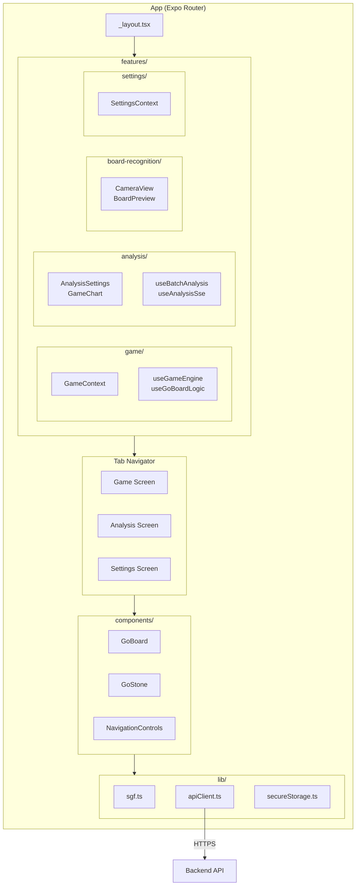

# ADR-002: Frontend Architecture

## Context
The Go Analysis mobile app needs to display Go boards, game analysis, and handle user interactions efficiently on iOS and Android.

## Decision
We use **React Native with Expo** and a context-based state management approach.

## System Architecture



## State Management

### Context Responsibilities

| Context | State | Methods |
|---------|-------|---------|
| `GameContext` | `rootNode`, `currentNode`, `isAnalyzing` | `handleLoadSgf`, `handleStartAnalysis` |
| `SettingsContext` | `backendConfig`, `thresholds`, `language`, `theme`, `ghostStoneDisplay` | `setBackendType`, `setThreshold`, `toggleTheme` |
| `ErrorContext` | `error`, `visible` | `showError`, `clearError` |

### Data Flow

```
User Action → Context Method → State Update → Component Re-render
     │                              │
     └─────── API Call ─────────────┘
                 │
          apiClient.ts (Circuit Breaker)
                 │
            Backend API
```

## Component Hierarchy

### Core Components

| Component | Props | Responsibility |
|-----------|-------|----------------|
| `GoBoard` | `board`, `onCellPress` | Renders 19x19 grid with stones |
| `GoStone` | `row`, `col`, `player`, `onPress` | Single stone with accessibility |
| `GameChart` | `winrates`, `scores`, `mode` | Winrate/score visualization |
| `NavigationControls` | navigation callbacks | First/Prev/Next/Last buttons |
| `FloatingActionMenu` | action callbacks | FAB for main actions (Load/Save/Export) |
| `AnalysisSettings` | `onStartAnalysis` | Config modal for depth/range |
| `UnifiedMoveList` | `variations` | Scrollable list of move variations |

### Hook Responsibilities

| Hook | Input | Output |
|------|-------|--------|
| `useGoBoardLogic` | `activeNode` | `board`, `capturedByBlack/White` |
| `useGameHistory` | `rootNode` | `winrates`, `scores`, `moveNodes` |
| `useAnalysisData` | `props` | `ghostStones`, `errorIndices`, `chartData` |
| `useAnalysisSse` | `sgf`, `config` | `startStream()`, progressive updates |
| `useRenderBudget` | `componentName` | `measureRender()`, performance warnings |

## Performance Optimizations

| Technique | Where | Impact |
|-----------|-------|--------|
| `useRef` for prev state | `useGoBoardLogic` | Prevents infinite loops |
| `push()` + `reverse()` | Path construction | O(n) vs O(n²) |
| Memoization | `useGameHistory` | Avoids recalculation |
| Circuit Breaker | `apiClient.ts` | Fast-fail on backend issues |

## Accessibility

| Component | Attributes |
|-----------|------------|
| `GoStone` | `accessibilityLabel`, `accessibilityRole="button"` |
| `ModernButton` | `accessibilityLabel`, `accessibilityState` |
| `NavigationControls` | `accessibilityRole="toolbar"` |

## Why This Approach

| Decision | Rationale |
|----------|-----------|
| Expo | Simplified build, OTA updates, cross-platform |
| Context API | Sufficient for app complexity, no Redux boilerplate |
| Expo Router | File-based routing, type-safe navigation |
| Custom Hooks | Separation of concerns, testability |

## Consequences

### Positive
- Fast development with Expo
- Shared codebase for iOS/Android
- Good testability with isolated hooks

### Negative
- Expo limitations for native modules
- Context can cause re-renders (mitigated with memoization)
