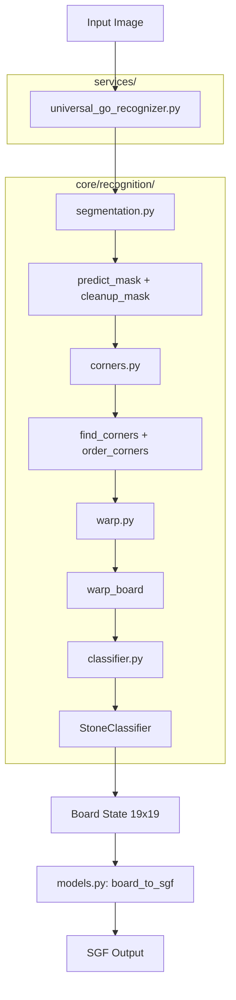

# ADR-003: UniversalGo ML Recognition Architecture

## Context
Users need to digitize physical Go boards by taking a photo. This requires a robust computer vision pipeline to:
1. Detect the board grid (19x19 lines).
2. Correct perspective distortion (Warping).
3. Classify stones (Black, White, Empty) on the board.

The previous solutions relied heavily on heuristic methods (OpenCV) which were fragile to lighting changes and shadows. We needed a machine learning approach to improve accuracy and robustness.

## Decision
We implemented **UniversalGo**, a hybrid ML/CV pipeline:

1.  **Grid Detection**: **DeepLabV3+ with ResNet50**
    -   **Task**: Semantic Segmentation (Pixel-wise classification of "Board" vs "Background").
    -   **Why**: Robust against cluttered backgrounds and partial occlusion compared to edge-based detection (Canny/Hough).
    -   **Architecture**: Pre-trained ResNet50 backbone, fine-tuned on Go board dataset.
    -   **Post-Processing**: Morphological cleanup -> Contour extraction -> Corner ordering.

2.  **Perspective Correction**: **OpenCV Homography**
    -   Standard 4-point perspective transform using detecting corners.
    -   Output size: 608x608 pixels (optimal for stone classifier).

3.  **Stone Classification**: **ResNet9** (Custom CNN)
    -   **Task**: Image Classification (3 classes: Black, White, Empty).
    -   **Input**: 32x32 pixel patches extracted from the warped board.
    -   **Why**: CNNs generalize better to stone texture/reflections than color histograms.
    -   **Fallback**: Adaptive K-Means Clustering if ML model fails or confidence is low.

## System Architecture

## Module Structure

| Module | Location | Responsibility |
|--------|----------|----------------|
| `universal_go_recognizer.py` | `services/` | Orchestration, model loading |
| `segmentation.py` | `core/recognition/` | DeepLabV3+ mask prediction (TTA) |
| `corners.py` | `core/recognition/` | Hough lines + contour fallback |
| `warp.py` | `core/recognition/` | Perspective homography |
| `classifier.py` | `core/recognition/` | CNN/K-Means/Heuristic classification |
| `models.py` | `core/recognition/` | ResNet9 definition, board_to_sgf |

## Component Details

### 1. Segmentation (`segmentation.py`)
-   **Model**: `deeplabv3_resnet50` (PyTorch).
-   **Input**: 520x520 RGB image (resized).
-   **Output**: Binary mask (Board vs Background).
-   **TTA**: Horizontal flip averaging for robustness.

### 2. Corner Detection (`corners.py`)
-   **Primary**: Hough lines intersection.
-   **Fallback**: Contour-based detection.
-   **Output**: 4 corners in centroid-angle order.

### 3. Stone Classification (`classifier.py`)
-   **Model**: Custom 9-layer ResNet (ResNet9).
-   **Input**: Batch of 361 patches (32x32 RGB).
-   **Output**: 361 classification labels.
-   **Performance**: ~98% accuracy on validation set.
-   **Cascade**: CNN → Adaptive K-Means → HSV Heuristic.

## Data Strategy

To achieve robustness, we curated a hybrid dataset:

1.  **Board Segmentation**:
    -   **Synthetic Data (Blender)**: 1,000+ photorealistic renders.
    -   **Real Data**: ~200 labeled photos of physical boards.
    -   **Augmentation**: Color jitter, rotation, lighting simulation.

2.  **Stone Classification**:
    -   **Physical Stones**: Patches from photos of real stones.
    -   **Digital Stones**: Samples from online Go servers.
    -   **Augmentation**: Heavy color and perspective augmentation.

## Alternatives Considered

| Approach | Pros | Cons | Decision |
|:---------|:-----|:-----|:---------|
| **Pure OpenCV** | Fast, no dependencies | Brittle to lighting | kept as fallback |
| **YOLO** | Detects stones directly | Not the best for gird/difficult Licence | Rejected |
| **End-to-End Transformer** | State-of-the-art | High training cost | Rejected |
| **Segmentation + CNN** | Modular, robust | Balanced | **Selected** |

## Consequences

### Positive
-   **Robustness**: Handles shadows and diverse lighting.
-   **Modularity**: Each module can be tested/replaced independently.
-   **Maintainability**: Clear separation of concerns.

### Negative
-   **Size**: Weights file (~100MB) increases artifact size.
-   **Latency**: Slower than pure OpenCV.
-   **Dependencies**: Requires `torch` and `torchvision`.

## Related Documents
-   [ADR-001-Backend-Architecture.md](./ADR-001-Backend-Architecture.md)
